# Dorftipster

**Dorfromantik tile placement helper**

This application was designed to support you in playing the game Dorfromantik.
It will boost the playing experience, especially in the later game as the suggestions will help you make good decisions and will ultimately allow you to continue your session for a very long time.

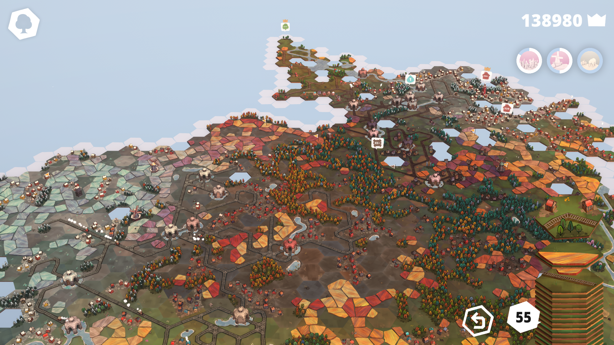
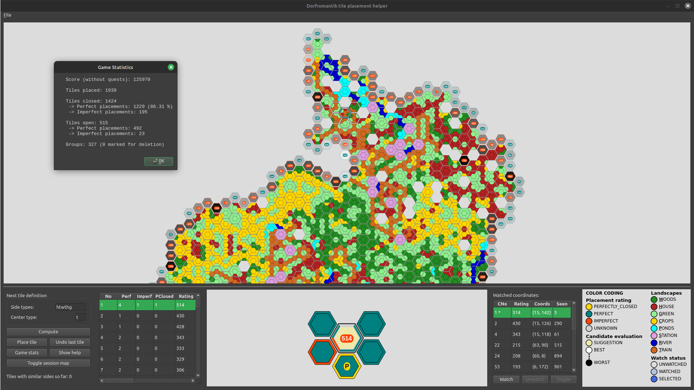

Key features:
- Allows you to easily mirror the actual game in the tile placement helper application
- Makes useful suggestions as to where to place the next tile
- Considers groups and many other criteria in order to make a good suggestion
- Allows to "watch" coordinates when you would like to focus on placing on specific positions
- Gives you many additional infos that will benefit your game and decision making

# Table of Contents
1. [Installation](#installation)
    - [System-level dependencies](#system-level-dependencies)
    - [Installing Python and pip](#installing-python-and-pip)
    - [Installing Dependencies](#installing-dependencies)
    - [Running the Application](#running-the-application)
2. [How to](#how-to)
    - [User Interface](#user-interface)
        - [Session map](#session-map)
        - [Control panel](#control-panel)
        - [Candidate list](#candidate-list)
        - [Candidate placement visualization](#candidate-placement-visualization)
        - [List of watched coordinates](#list-of-watched-coordinates)
            - [Toggle](#toggle)
            - [Watch](#watch)
            - [Unwatch](#unwatch)
            - [Color coding](#color-coding)
        - [Legend](#legend-color-coding)
    - [Keyboard and mouse usage](#keyboard-and-mouse-usage)
    - [Save and load](#save-and-load)
        - [Autosave](#autosave)
    - [Play](#play)
    - [Correct errors](#correct-errors)
3. [Rating computation](#rating-computation)
    - [Tile placement rating](#tile-placement-rating)
    - [Group rating](#group-rating)
        - [Perspective group extension](#perspective-group-extension)
    - [Neighbor group inteference rating](#neighbor-group-interference)
    - [Neighbor compatibility rating](#neighbor-compatibility-rating)
    - [Type demotion rating](#type-demotion-rating)
        - [Type threshold](#type-threshold)
        - [Station consideration](#station-consideration)
        - [Restricted type blockage](#restricted-type-blockage)
    - [Restricted type orientation rating](#restricted-type-orientation-rating)

# Installation
## System-level dependencies

Before running the project, make sure you have the following system-level dependencies installed:

### Ubuntu/Debian
```
sudo apt-get update
sudo apt-get install -y libgl1-mesa-glx libegl1-mesa libxkbcommon0 libdbus-1-3
```

### macOS and Windows
On Windows and macOS, OpenGL should be available by default.

## Installing Python and pip

**Please note:** The project requires Python 3.8 or higher

### Windows
1. Download Python from [python.org](https://www.python.org/downloads/).
2. Run the installer and check "Add Python to PATH" option.
3. Complete the installation.

### macOS
1. Install Homebrew if not already installed:
    `/bin/bash -c "$(curl -fsSL https://raw.githubusercontent.com/Homebrew/install/HEAD/install.sh)"`
2. Install Python:
    `brew install python`

### Linux
1. Update package list:
    `sudo apt update`
2. Install Python and pip:
    `sudo apt install python3 python3-pip`

## Installing Dependencies
Open a terminal and navigate to the project directory:
    `cd path/to/dorfromantik`

Install the required packages:
    `pip install -r requirements.txt`

## Running the Application

Run the application from the project directory:
    `python -m src`

(If there is no symlink for `python`, use `python3` instead)

# How to

This section describes the user interface and how to play.

## User Interface
The application is split into two main layouts.
The top layout shows the [session map](#session-map) and the bottom layout contains (from left to right)
- the [control panel](#control-panel)
- the [candidate list](#candidate-list) and their individual ratings
- the [visualization of the placement for the currently selected candidate](#candidate-placement-visualization)
- the [list of watched coordinates](#list-of-watched-coordinates)
- the [legend](#legend-color-coding) that quickly helps to understand the color coding

### Session map
The session map mirrors the map session map in the game.
Please refer to the color coding in the legend in the bottom right of the application for the [color coding of the landscapes](#legend-color-coding).

By default, the session map shows the landscapes. The view may be toggled to visualize the placement ratings using the [control panel](#control-panel).

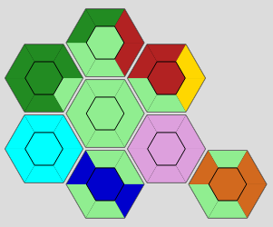
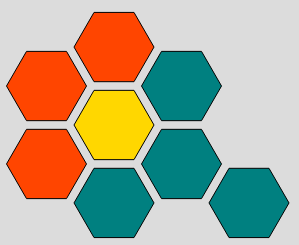

The landscape colors are the following:

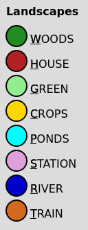

Please refer to the [Candidate placement visualization](#candidate-placement-visualization) for more details on the color coding of placement ratings.

When currently not displaying any candidates, all open coordinates (that neighbor a played tile) may be shown. This also allows to watch coordinates. For more details on this, refer to the [list of watched coordinates](#list-of-watched-coordinates).

When the next tile definition is specified and the "Compute" button has been pressed, the session map will display the candidates, using a consise visualization that contains the most important information:

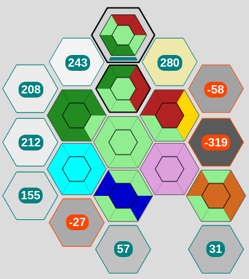

The candidate is highlighted with a black border, followed by a color that indicates the side placement towards each of the opposing tiles.

In the example, candidates are computed for a tile that contains the side sequence GREEN, WOODS, WOODS, GREEN, HOUSE, HOUSE and a center of GREEN.
The session map will show all positions where the candidate may be placed. For each of these positions, we show the rating of the best orientation of the candidate tile. The rating as well as the candidate border allow to quickly see, whether the candidate allows a perfect match or not (teal: perfect, orange: imperfect).
Additionally, the background color of the candidate indicates the rating with regards to the best and worst rating. The brighter the background, the better the rating, the darker the background, the worse the rating.
The best rated candidate(s) are highlighted with a slightly yellow color (all candidates that share the highest rating).

By default, the best candidate is automatically selected and focussed after computing.
The selected candidate also directly indicates the tile placement rating - please refer to the [Candidate placement visualization](#candidate-placement-visualization) for a detailed description.

#### Interaction with the session map
- When candidates are displayed, one may selected candidates by clicking them.
- When open coordinates are display, one may select coordinates by clicking them.
- A double click anywhere in the session map will refocus the map
- The mouse wheel handling is implemented similarly to the game itself:
    - when the mouse is over the selected candidate, the candidate will be rotated
    - when the mouse is anywhere else in the map, the map will be zoomed
- Left mouse and middle mouse allow dragging the map (panning), when clicking and holding the button, similar to the game itself

The session map also allows keyboard interaction, refer to [Keyboard shortcuts](#keyboard-shortcuts).

### Control panel

The control panel allows to interact with the application. It consists of the following elements:

- Next tile definition (as suggested by the actual game)
    - Side types: The side type sequence of the next tile; Expecting either
        - six characters, one for each side types **OR**
        - a single character for all side types and center (in this case, it is not necessary to specify the center type)
    - Center type: The center type of the next tile
        - a single character for the center type

You can use the `TAB` key to quickly change from the side types to the center type and then confirm using `Enter` or `Return`.

It does not matter, which side you begin with, but in order to minimize errors, a good practice is to start with the TOP side and then iterate clockwise.

**PLEASE NOTE**: The tile placement helper orientation should always be aligned with the orientation of the actual session map.
You can use the Backspace key, both in Dorfromantik and the tile placement helper to reset the transformation (note that the session map must have focus for Key events to be recognized).

Example side sequence:

For the following tile, the side sequence (starting TOP) would be: `ghhghg` with a center type `h`.

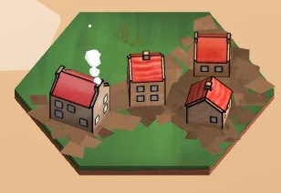

Normally, the center type allows all sides that share the center type to connect.

If there is a side that should be isolated from the center, specify it in parenthesis. This will ensure that there is no connection from the given side to any other sides of the same type through the center.

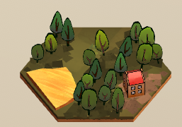

For this example tile, the side type sequence would be `gwhwc(w)` with a center type `w`.

Side type characters may be specified in both, upper and lower case

Valid landscape side type values:
- `W` - Woods/Trees
- `H` - Houses
- `G` - Green/Plains
- `C` - Crops/Fields
- `P` - Ponds/Water
- `S` - Station (Watertemple)
- `R` - Rivers
- `T` - Train tracks

Refer also to the [legend](#legend-color-coding) for the characters to use for the different side types or use the "Show help" button, see below.

- Compute: Once you have specified the next tile definition, this will compute the candidates for the input sequence and center
    - On invalid input, the help (refer to "Show help" will automatically be shown)
    - When clicked again without a change in input, we will reset the selection to show the best candidate
- Place tile: Once you have made a selection for a candidate, this will place the candidate
- Undo last tile: This will undo the last placed tile (only one undo allow, similar to the game)
- Game stats: Shows the statistics for the game
- Show help: Displays a help window that contains a short description of how to specify the next tile
- Toggle session map: Will toggle the session map between the actual landscapes and the placement rating for all placed tiles.

Refer to the [legend](#legend-color-coding) to understand the color coding of the placement ratings for the placed tiles.

In the very bottom of the control panel, one may find a text "Tiles with similar sides so far:".
This will be filled after candidates have been computed and will show a number that indicates how many tiles have already been placed in the session that have sides that are either exactly the same as the given tile or are of a compatible type.

Example:

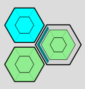

For the given example, when the new candidate has green sides (highlighted), the number of tiles with similar sides so far is 2.
Both, the already placed all green and the already placed all ponds tile would allow to be placed everywhere perfectly, where the candidate all green tile would be.

This information is especially useful later in the game to let you make tough decisions on whether to place a tile imperfectly or not.
It is a good idea to combine this with the "Seen" column in the [list of watched coordinates](#list-of-watched-coordinates).

### Candidate list

Once one has clicked "Compute", this will contain all candidates in all possible orientations.
The most important columns are directly visible. These are:

- No (Candidate number): Starting with 1, order by rating. The lower the number, the better the overall rating
- Perf (Perfect side placement count): Number of sides that will be perfectly placed against another tile
- Imperf (Imperfect side placement count): Number of sides that will be imperfectly placed against another tile
- PClosed (Perfectly closed tiles count): Number of tiles (including the candidate tile) that will be perfectly closed if the candidate is placed
- Rating (Candidate rating value): Overall rating value that the application has computed. The higher, the better.

You can click on any column name to the table accordingly.

**Please note**: You may always reset the candidate list to the initial state by reclicking "Compute"

One may scroll to the right to see more columns which contain subratings, that are included in the overall rating.
These rating will normally not be of any relevance, unless debugging or extending the application with new features.

See [Rating computation](#rating-computation) for a full break down of all ratings.

### Candidate placement visualization

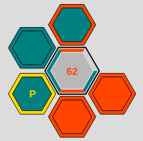

When computing candidates, the selected candidate is highlighted in the [session map](#session-map) and the candidate with the direct neighboring tiles is displayed in the Candidate placement visualization.

The inner border of the highlighted candidate is colored separately for each side and indicates the side placement towards each of the opposing tiles.

The following color coding applies:

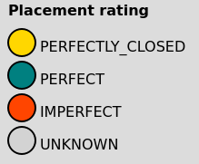

* teal: indicates a perfect placement for the side
* orange: indicates an imperfect placement for the side
* gray: indicates an unknown placement (no neighbor)

The candidate is highlighted, and shows the side placement on the outer border, as described above.
The center color of the candidate is an indication of the rating value.

The following color coding applies:

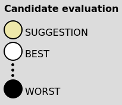

* beige: indicates the candidate with the highest overall rating
* gradient from white to black: corresponding to the overall rating, best to worst

The surrounding tiles are the direct neighbors that the candidate connects to.
The center of those tiles is colored according to the tiles current placement evaluation
* teal: indicates that the tile only has perfect placements for sides so far
* orange: indicates that the tile has at least one imperfect placement for a side already (and can therefore never be perfectly closed anymore)

The outer border is a color indication of the tiles placement evaluation, if the candidate were to be placed. The color coding is similar to the current placement evaluation, with the addition of
* gold: indicates that the neighboring tile would be perfectly closed with the candidate (also indicated by the golden P in the neighbor tile center)

### List of watched coordinates
The table to watch specific coordinates is a great feature, especially for later in the game.

It allows to watch/unwatch open coordinates that one wants to keep in focus.

When selecting a candidate or open coordinates, it automatically displays the information for that position.
These are:

- CNo (Candidate number): Candidate number refering to the [candidate list](#candidate-list) or "---" when currently not showing candidates
    - An asterisk (*) is added to the CNo entry if the entry is currently not watched and was automatically display
- Rating: Candidate rating value as per [candidate list](#candidate-list)
- Coords: Coordinates of the position
- Seen: Number of tiles that have already been placed that would perfectly match the given candidate position / open coordinates.
    - Takes into account all known sides and evaluates the number of tiles that would match perfectly.

The "Seen" column is very informative later in the game as it allows us to decide whether to place a candidate on a position (e.g. when we have never seen any tile that would have fit perfectly before).

Please note that we only take into account the known sides. Consider the following example:

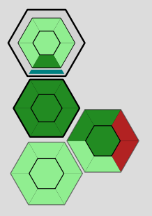

Here the number of tiles seen that would match perfectly is 2, as there were two tiles that hat at least one side of Woods.

Therefore, the more known sides there are, the more specific the information will be.

#### Toggle
The "Toggle" button is enabled, when currently not displaying any candidates.

When clicked, all open coordinates that would be potential future placement locations of a next tile will be display.
One may click these open coordinates and choose to "Watch" (or "Unwatch") them.

#### Watch
When an open coordinate or candidate has been selected that is not yet watched, one may click the "Watch" button to permanently add the given coordinates to the list of watched coordinates.

When computing candidates, the watched coordinates list will be ordered by rating, therefore one may quickly check all watched positions for a good match.

When placing a candidate on a watched position, it will automatically be unwatched.

#### Unwatch
When a coordinate or candidate position has been added to the watched coordinates list, selecting it and pressing "Unwatch" will remove it from the list.

#### Color coding
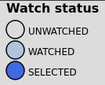

When displaying open coordinates, the above color coding applies.

### Legend (Color coding)
Contains a quick overview of the color coding of all drawn elements.

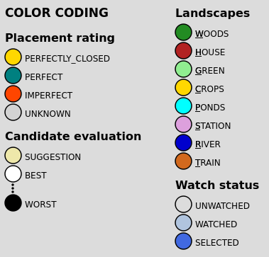


## Keyboard and mouse usage
This is the list of possible interactions with the tile placement helper through keyboard and mouse.
Most of the keyboard and mouse commands are similar to the game itself.

**Please note** that the session map needs to be in focus for the keyboard shortcuts to work.

| Input                   | Action                | Precondition                                       |
| ----------------------- | --------------------- | -------------------------------------------------- |
| mouse wheel             | Zoom in/out           | Mouse anywhere in the map, but not over candidate  |
| ctrl + '+'              | Zoom in               |                                                    |
| ctrl + '-'              | Zoom out              |                                                    |
| 'c'                     | Zoom in               |                                                    |
| 'x'                     | Zoom out              |                                                    |
| right mouse click&hold  | Rotate camera         |                                                    |
| 'q' / 'e'               | Rotate camera         |                                                    |
| mouse wheel             | Rotate candidate      | Candidates computed; Mouse over selected candidate |
| 'r' / 'f'               | Rotate candidate      | Candidates computed                                |
| ctrl + mouse wheel      | Rotate candidate      | Candidates computed                                |
| left mouse click        | Selected candidate    | Candidates computed; Mouse over candidate          |
| left mouse click&hold   | Move camera           |                                                    |
| middle mouse click&hold | Move camera           |                                                    |
| arrow ← ↑ → ↓           | Move camera           |                                                    |
| 'w' 'a' 's' 'd'         | Move camera           |                                                    |
| Backspace               | Reset camera          |                                                    |
| enter / return          | Place candidate       | Candidates computed; Desired candidate selected    |
| t                       | Toggle session map    |                                                    |
| ctrl + 'w'              | Watch open coords     | Candidate or open coordinates selected             |
| ctrl + 'u'              | Unwatch open coords   | Candidate or open coordinates selected             |
| ctrl + 't'              | Toggle coords display | No candidates computed                             |

## Save and load
The `File` dialog allows the following actions:
- New Session: Start a new session
- Save Session: Save session to database, you will be asked to specify the name for the session
    - It is valid to reuse the same name for the session.
    - Each time you save, a new database entry will be created
- Save Session as CSV: Save session as CSV
    - **Please note**: Saving a session to CSV will not save watched coordinates
- Load Session: Load session from database
    - Load as played: Load session as played (this is usually what we want)
    - Load simulated tile placement: Load session but compute candidates for each tile in the session and always place the best candidate
        - This is especially useful when introducing new tile evaluations or changing score values to evaluate the performance
    - Load/simulate tile by tile: Load session and prefill the next tile definition, tile by tile with the tiles in the session
        - This helps to question how the application rates the placements and is designed for debugging / analyzing
    - **Please note**: When loading larger sessions, the application may seem unresponsive.
- Load Session from CSV: Load session from CSV
- Delete Session: Delete a session from the database
- Exit: Exit the application

The database is created and stored locally as `sessions.db`. Be careful not to delete the file as this would also delete all saved sessions.

### Autosave
Sessions are automatically saved whenever you place a tile.

**NOTE**: The `__autosave__ ` save game will be reused and is intended only to restore the session if the application or your computer should crash. It does not save watched coordinates and it will overwrite any preexisting autosave, once a new tile is placed in whichever session.

## Play
It is important to notice that one should not always follow the suggestions of the tile placement helper, as it does not consider quests as of now.

It usually makes sense to add important tiles (e.g. for quests) to the watch list and check against these frequently. It also makes sense to check the first couple of candidates before placing, to get an overview of good options.

If you have two monitors available, place the Dorfromantik game on one side and the tile placement helper on the other. This is allows for quick usage.

When sessions get larger, computation times may get slower. However the performance should stay within a couple of seconds and is therefore not optimized prematurely.

## Correct errors
If you notice later in the game that you have placed a tile differently, export the game as CSV, change the tile side sequence and center accordingly in the CSV and then load the game from CSV.

# Rating computation
The tile placement helper will support you in playing Dorfromantik and will make suggestions based on a rating that is computed for each possible candidate placement.
The rating consists of the following categories:

## Tile placement rating
For the candidate tile position we look at each of the six tile sides and evaluate whether the side type matches the opposing side.
For each side pair we differ between the following:
* Perfect match
    * that will perfectly close the opposing tile
    * against an (up until now) perfect opposing tile
    * against an already imperfect opposing tile
* Imperfect match
    * against an (up until now) perfect opposing tile
    * against an already imperfect opposing tile
* Unknown match (opposing tile is not yet played)
* *Impossible match*

Whenever we encounter at least one side that is an *Impossible match*, the candidate is discarded and will never be suggested.
Based on the above side match evaluation, a tile placement rating is computed.

The tile placement rating will be the sum of the individual side placement ratings, whereby the above list indicates the value of the individual side placement rating in descending order.
Additionally, a bonus will be applied for whenever a candidate *plugs a hole*, leaving no open neighbors for itself.

The side placement evaluation is easily visible within the session map, please refer to [Candidate placement visualization](#candidate-placement-visualization) for more details.

## Group size rating
We recognize and consider groups automatically.
The group size is calculated as the sum of the connected tile sides/centers of the group type.

### Group types
We consider the following types group types:

* Woods
* House
* Crops
* Ponds (considered restricted)
* River (restricted)
* Train (restricted)

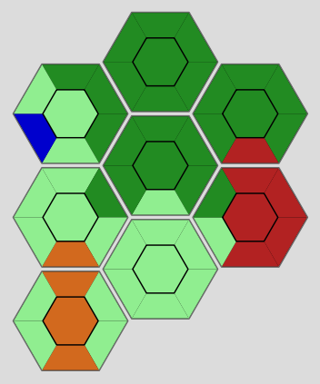

The example contains 4 groups, with descending sizes: *Woods* (size 24), *House* (size 6), *Train* (size 3), *River* (size 1)

- The *group size rating* will be highest for candidate tiles that extend existing groups.
- The rating will be higher, the larger the group is that we are extending, as we usually want to keep on extending larger groups for quests
- The rating will be higher, if we are extending a restricted type group (any water type/train tracks), as these types are less frequent

In the example, we would suggest extending existing groups with candidates rather than opening new ones. Also, we would favor extending restricted type groups, even if their size is smaller than a non-restricted type group.

This rating serves the purpose of optimizing towards larger groups, which often are also coupled with quests.

### Perspective group extension
As part of the group size rating, we also consider perspective group extensions.

This serves the purpose to rather place a tile close to an existing group rather than some random place in the map in the hope that we might connect to an existing group at some point.

The path to a distant group will follow open tiles (assuming that the candidate tile was already placed).

Consider the following example:

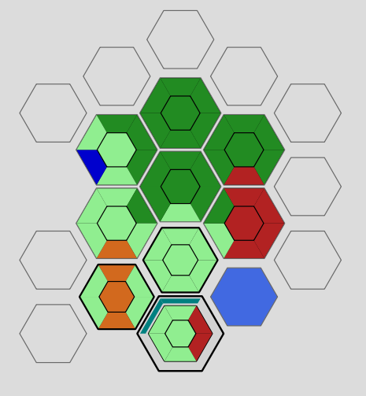

The candidate tile at the highlighted position will recognize that there is a house group nearby (in a distance of 1 tile).
We will consider the distant group size with the following factors:

- At distance 0 (extension of group, see above): full size
- At distance 1: full size (direct neighbor)
- At distance 2: 1/2 of the size
- ...
- At distance 7 (`MAX_DIST`): 1/7 of the size

`MAX_DIST` is defined as follows:
- for non-restricted group types (crops, woods, house): 4
- for restricted group types (ponds, river, train): 7

For perspective group extensions, the same mechanisms as above apply: when perspectively extending a restricted type group, the size is boosted.

Please note that a perspective group extension will be cut off when crossing a restricted type.

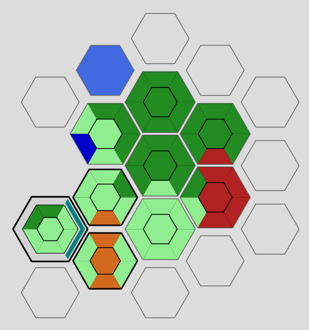

We would normally consider a perspective group for the wood group at the highlighted open tile in a distance of 3.
However in this case, we will not consider it, because we are "crossing" a restricted type (river in this case).

We are assuming that a restricted type will usually cut of other group types.


## Neighbor group inteference rating
The previous rating described how we are considering an extension of a group or a perspective extension of a distant group in a positive way.

The Neighbor group interference rating evalues whether we are interfering with a direct neighbor group.

For all outgoing sides of a tile that have a [group type](#group-types), we will evaluate whether the side faces an open tile that already faces a different group type.
If that is the case, we will apply a negative rating, that is also scaled by the distant group size that we are blocking.

When either the side of the candidate tile is of a restricted group type or the group that we are seeing is of a (incompatible) restricted type, we will apply a stronger negative rating.

In the following example, a malus would be applied as
- the river side of the candidate tile blocks a train, a crops and a woods group
- the house side of the candidate tile blocks a train, a woods and a crops group

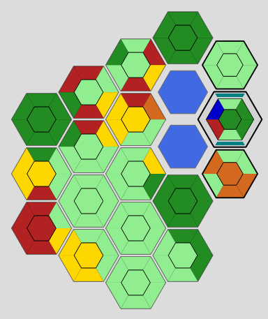

This rating serves the purpose of orientating the candidate tile in a way to minimize incompatible group interference.

## Neighbor compatibility rating
For each side of the candidate tile, we will evaluate any side that is facing an open tile as a neighbor.
For each of these neighbors, we will look at all known tiles that are directly adjacent to the open neighbor tile.
All of these types will be compared against the candidate tile side type.

The previous two ratings only take [group types](#group-types) into account, which leaves the landscape types GREEN and STATION.
These types are considered in the Neighbor compatibility rating.

This rating serves the purpose to face green/station types towards compatible types rather than incompatible types and to balance out the group side type consideration of the previous two ratings.


## Type demotion rating

The type demotion rating consists of three different sub-ratings.

### Type threshold
There is a limit of [four different types for any tile](https://dorfromantik.fandom.com/wiki/Tiles).

For each side of the candidate tile, we will evaluate any side that is facing an open tile as a neighbor.
For each of these neighbors, we will count the number of different types that is already known.
If the candidate were to introduce a new type with the candidate tile side facing the open tile, a penalty will be applied to the Type threshold rating.

The reason for this is that we can be certain that there would never be a perfect matching tile for the open neighbor anymore, therefore we try to avoid suggesting a candidate like this.


The example shows a candidate of type "House". The candidate would introduce a fifth type for the two open neighbors on the left of the candidate.
Therefore, for both neighbors, a penalty will be added to the rating.

This rating serves the purpose to avoid placing a candidate in a position were it destroys the option of at least one open neihbor position to ever receive a tile that may be perfectly closed.

### Station consideration

If the candidate tile would introduce a restricted type that is not yet present for the open tile, we know that only a station will perfectly match there.
Therefore apply a demotion if a station would not perfectly match the open tile.

In the following example, the train side faces only station compatible types, therefore no demotion would be applied:

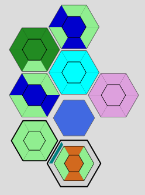

If the candidate would however be placed in the following position, we would know that a station could never be perfectly placed (due to the woods side), therefore a demotion is applied:

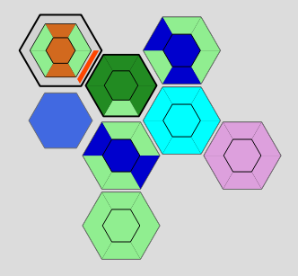

This rating serves the purpose to avoid placing restricted types that we already know will produce an imperfect placement in the future.

### Restricted type blockage

If the open tile that the candidate side faces contains a restricted type, we will apply a demotion as we usually want to avoid blocking restricted types in their extension.

Consider the following example:

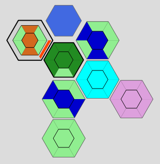

We will apply a demotion as we are reducing the amount of open sides that the river may be continued with.
This demotion is the larger, the more known sides there are already.

This rating tries to keep many options for restricted types to be continued, as these usually are rare and difficult to find.

## Restricted type orientation rating

The restricted type orientation rating tries to orientate candidate tile sides that have a restricted types towards more open spaces.
It will evaluate the amount of already placed tiles that surround the outgoing side and will suggest to orientate the candidate tile where the amount of known tiles is minimized.

This rating mainly serves the purpose of finding the right orientation for restricted type tiles.